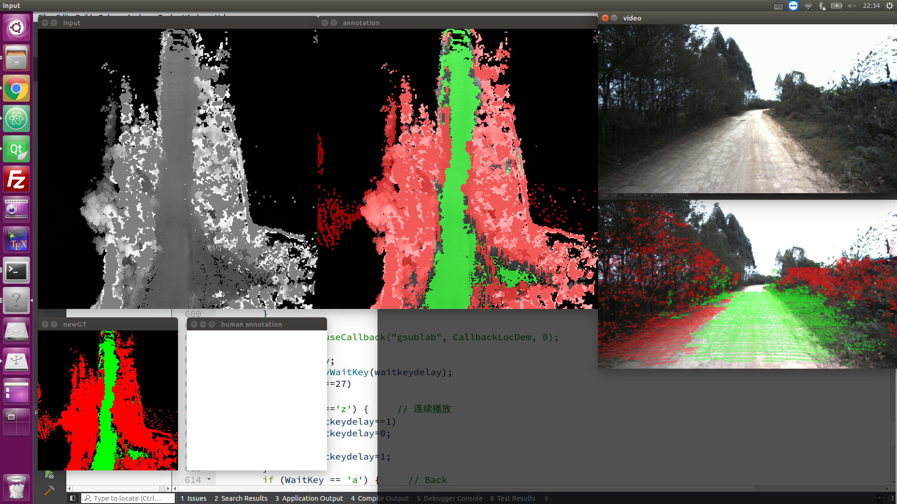
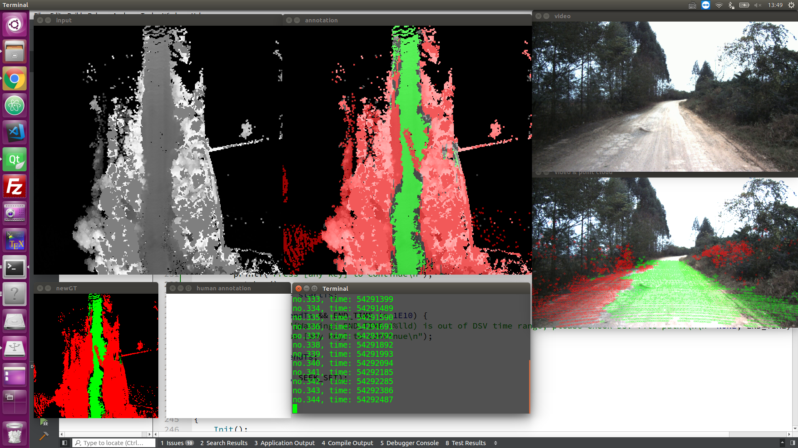
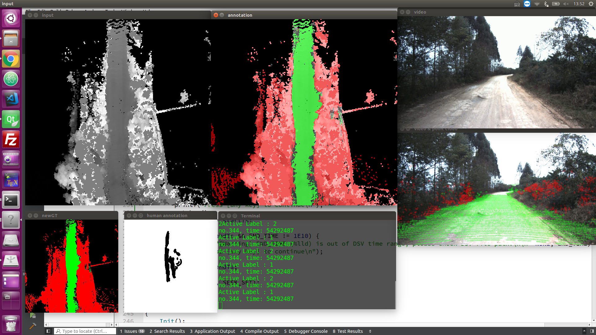
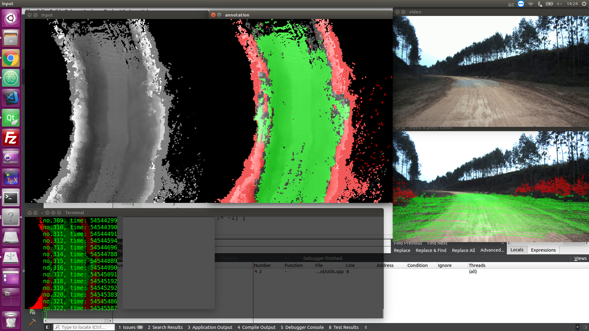
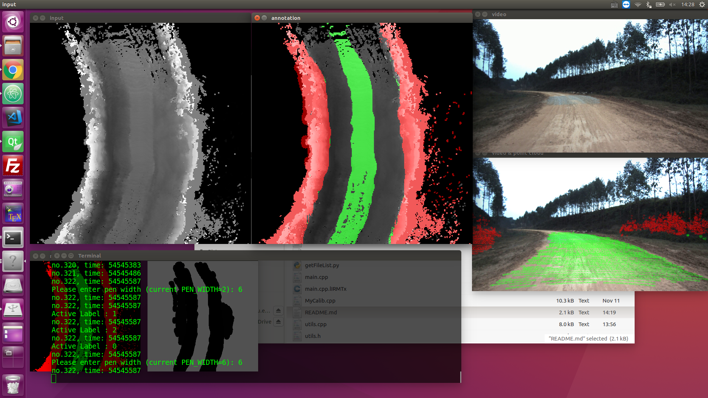
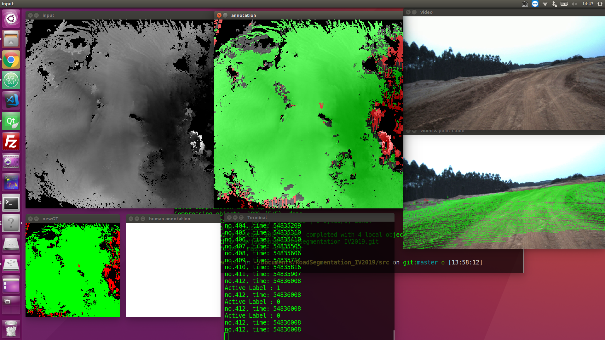
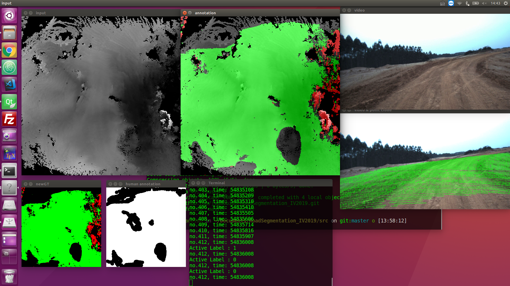
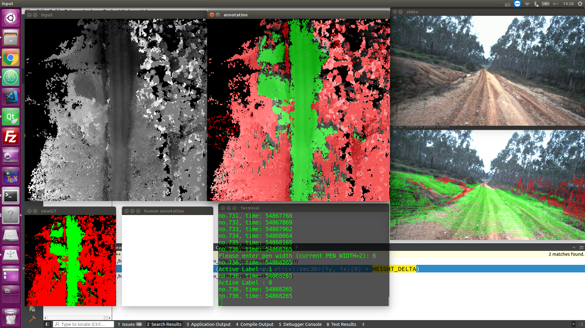
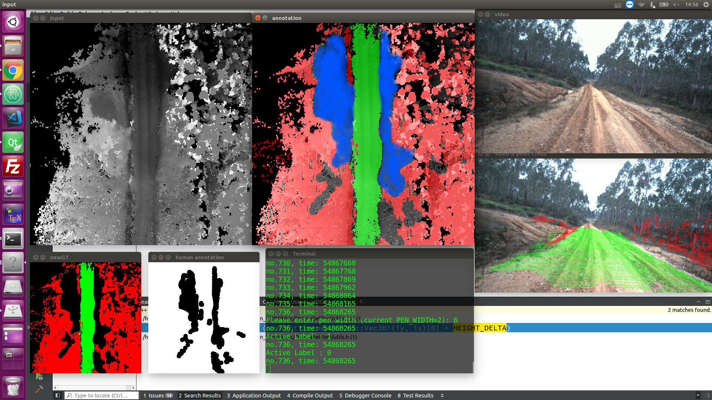

### 标注软件DemLabelTool使用方法

1. 在Ubuntu系统下，使用QtCreator打开工程，并编译通过
2. 将config.txt中的数据路径替换成本地的数据路径
    * FILE_LIST_PATH: 待标注文件名列表
    * ANNOTATION_PATH:保存人工标注真值的路径（需要自己建立文件夹）
    * UNANNOTATED_PATH:待标注的文件路径
    * CALIB_FILE:激光外参标定文件
    * DSV_FILE:激光+定位数据.dsv
    * AVI_FILE:视频文件.avi 需要在相同路径下包含同名的 .avi.ts文件
    * CAM_CALIB_FILE:激光和相机的标定文件
    * START_TIME:标注开始时间戳，0表示从头开始
    * END_TIME:标注结束时间戳，-1表示到文件结尾
3. 如果时间段[START_TIME, END_TIME]超出DSV文件范围，会有警告提醒. 请根据时间段选择合适的DSV文件
4. 运行程序
    
5. 在input或者annotation窗口进行标注
6. 窗口内容说明：
  - input: 激光DEM高程图（颜色越白高度越高），车辆位置位于图片中心，行驶方向向上
  - newGT: 真值图的可视化（绿色可通行，红色不可通行，蓝色为通行代价较高的模糊地带，黑色unknown）
  - annotation: input和newGT叠加的可视化图，用于标注
  - video:视频图像
  - video & point cloud: 将激光点投影到视频图像的结果
  - human annotation: 用于记录人工标注的线条（黑色），未修改过的区域为白色

### 标注程序按键说明

|  按键 | 说明  |
| ------------ | ------------ |
|鼠标左键 |绘制标注区域（在input窗口或者annotation窗口进行绘制)|
|a              |  前一帧数据|
|d              |下一帧数据|
|空格        	   | 保存当前帧标注结果|
|r              | 重置标注图像|
|p              		|设置画笔大小|
|0              |  设置标注类别为0，Unknown|
|1              | 设置标注类别为1，可通行（绿色）|
|2              | 设置标注类别为2，不可通行（红色）|
|3 | 设置标注类别为3，模糊区域/通行代价高（蓝色） |
|esc           |退出|

### 标注程序的逻辑

1. 读取UNANNOTATED_PATH中的待标注图片（包括input/video/ground truth三类，input为激光DEM高程图，video为视频截图，groundTruth为传统调参方法“DsvSegRegion”生成的真值）
2. 在DSV文件和视频文件中，找到1.中对应时间戳的激光和图像，根据groundTruth中的激光点分类，将激光点投影到视频中
3. 人工标注：在传统方法生成的groundTruth的基础上进行修改，并将人工标注的真值保存到ANNOTATION_PATH中
4. 激光到视频的投影存在一定误差，仅供参考

### 标注原则

1. 绝对可通行和绝对不可通行的区域用类别1\2标注

2. 模棱两可的区域（例如草地），如果初始为可通行区域，则倾向按照类别3（模糊区域/通行代价高）标记

3. 一些典型情况参考样例（标注前后对比图）

   1. 样例1（简单场景）

   * 道路中间的异常红色线条为HDL-32和HDL-64干扰产生的激光点，需要去除
   * 微调道路边界
      标注前

      标注后

   2. 样例2（道路两侧有模糊地带）
   * 将模糊地带（物理可通行，但是通行代价明显大于道路区域）标记为类别3(蓝色)
     标注前
   标注后

   3. 样例3 （大平原）
   * 红绿混杂的区域和零散的边缘，如果不能确定属于类别3，则标记为unknown
   标记前
   标记后
   4. 样例4（类似样例2）

      标记前

      标记后

